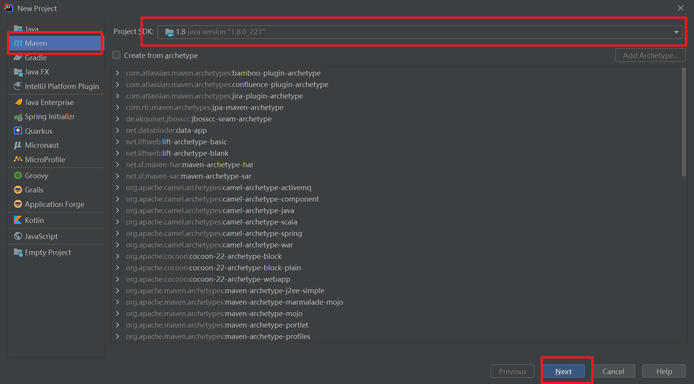
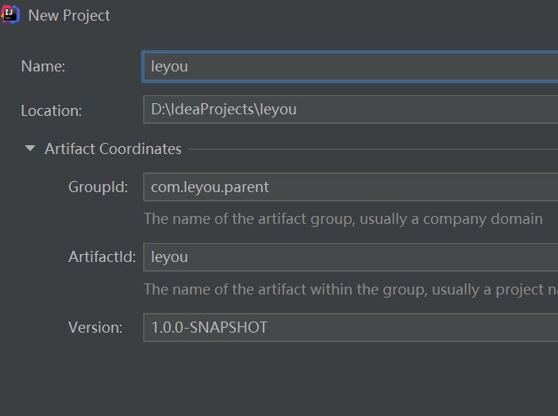
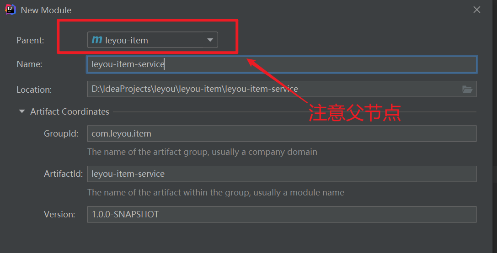
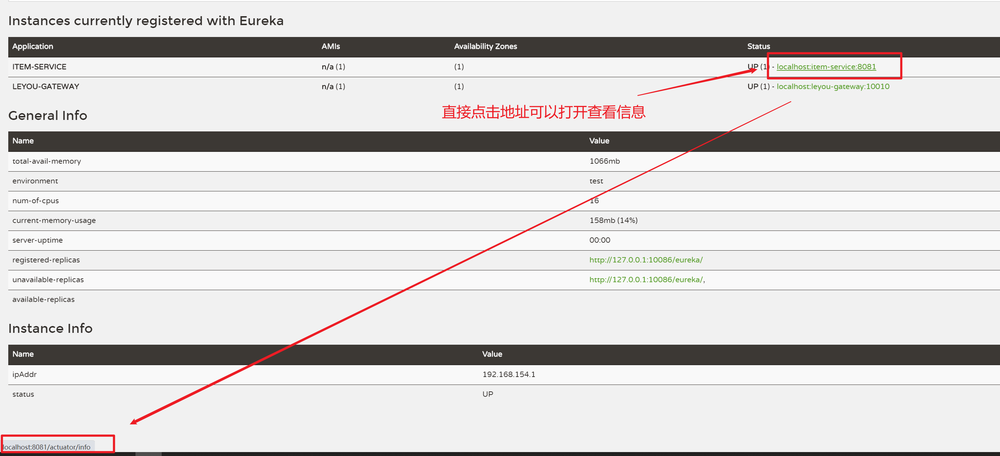

# 项目搭建

## 1.1 创建父工程

创建统一的父工程：leyou，用来管理依赖及其版本，注意是创建project，而不是moudle



项目信息如下所示：



### 1.1.2 配置文件

1. spring官网查看springcloud对应的springboot版本，注意版本依赖关系
2. 我们在父工程中引入了SpringCloud等很多以后需要用到的依赖，以后创建的子工程就不需要自己引入了。

```xml
<?xml version="1.0" encoding="UTF-8"?>
<project xmlns="http://maven.apache.org/POM/4.0.0"
         xmlns:xsi="http://www.w3.org/2001/XMLSchema-instance"
         xsi:schemaLocation="http://maven.apache.org/POM/4.0.0 http://maven.apache.org/xsd/maven-4.0.0.xsd">
    <modelVersion>4.0.0</modelVersion>

    <groupId>com.leyou.parent</groupId>
    <artifactId>leyou</artifactId>
    <version>1.0.0-SNAPSHOT</version>

    <parent>
        <groupId>org.springframework.boot</groupId>
        <artifactId>spring-boot-starter-parent</artifactId>
        <version>2.3.3.RELEASE</version>
    </parent>

    <properties>
        <project.build.sourceEncoding>UTF-8</project.build.sourceEncoding>
        <project.reporting.outputEncoding>UTF-8</project.reporting.outputEncoding>
        <java.version>1.8</java.version>
        <spring-cloud.version>Hoxton.SR8</spring-cloud.version>
        <mybatis.starter.version>2.1.3</mybatis.starter.version>
        <mapper.starter.version>2.1.5</mapper.starter.version>
        <druid.starter.version>1.1.9</druid.starter.version>
        <mysql.version>8.0.21</mysql.version>
        <pageHelper.starter.version>1.3.0</pageHelper.starter.version>
        <leyou.latest.version>1.0.0-SNAPSHOT</leyou.latest.version>
        <fastDFS.client.version>1.27.2</fastDFS.client.version>
    </properties>

    <dependencyManagement>
        <dependencies>
            <!-- springCloud -->
            <dependency>
                <groupId>org.springframework.cloud</groupId>
                <artifactId>spring-cloud-dependencies</artifactId>
                <version>${spring-cloud.version}</version>
                <type>pom</type>
                <scope>import</scope>
            </dependency>
            <!-- mybatis启动器 -->
            <dependency>
                <groupId>org.mybatis.spring.boot</groupId>
                <artifactId>mybatis-spring-boot-starter</artifactId>
                <version>${mybatis.starter.version}</version>
            </dependency>
            <!-- 通用Mapper启动器 -->
            <dependency>
                <groupId>tk.mybatis</groupId>
                <artifactId>mapper-spring-boot-starter</artifactId>
                <version>${mapper.starter.version}</version>
            </dependency>
            <!-- 分页助手启动器 -->
            <dependency>
                <groupId>com.github.pagehelper</groupId>
                <artifactId>pagehelper-spring-boot-starter</artifactId>
                <version>${pageHelper.starter.version}</version>
            </dependency>
            <!-- mysql驱动 -->
            <dependency>
                <groupId>mysql</groupId>
                <artifactId>mysql-connector-java</artifactId>
                <version>${mysql.version}</version>
            </dependency>
            <!--FastDFS客户端-->
            <dependency>
                <groupId>com.github.tobato</groupId>
                <artifactId>fastdfs-client</artifactId>
                <version>${fastDFS.client.version}</version>
            </dependency>
        </dependencies>
    </dependencyManagement>

    <build>
        <plugins>
            <plugin>
                <groupId>org.springframework.boot</groupId>
                <artifactId>spring-boot-maven-plugin</artifactId>
            </plugin>
        </plugins>
    </build>

    <repositories>
        <repository>
            <id>spring-milestones</id>
            <name>Spring Milestones</name>
            <url>https://repo.spring.io/milestone</url>
            <snapshots>
                <enabled>false</enabled>
            </snapshots>
        </repository>
    </repositories>
</project>
```

## 1.2 注册中心

创建项目模块`leyou-registry`

### 1.2.1 添加依赖

```xml
<?xml version="1.0" encoding="UTF-8"?>
<project xmlns="http://maven.apache.org/POM/4.0.0"
         xmlns:xsi="http://www.w3.org/2001/XMLSchema-instance"
         xsi:schemaLocation="http://maven.apache.org/POM/4.0.0 http://maven.apache.org/xsd/maven-4.0.0.xsd">
    <parent>
        <artifactId>leyou</artifactId>
        <groupId>com.leyou.parent</groupId>
        <version>1.0.0-SNAPSHOT</version>
    </parent>
    <modelVersion>4.0.0</modelVersion>

    <groupId>com.leyou.registry</groupId>
    <artifactId>leyou-registry</artifactId>

    <dependencies>
        <dependency>
            <groupId>org.springframework.cloud</groupId>
            <artifactId>spring-cloud-starter-netflix-eureka-server</artifactId>
        </dependency>
    </dependencies>
</project>
```

### 1.2.2 添加配置

```yaml
server:
  port: 10086
spring:
  application:
    name: ly-registry
eureka:
  client:
    fetch-registry: false
    register-with-eureka: false
    service-url:
      defaultZone: http://127.0.0.1:${server.port}/eureka
  server:
    enable-self-preservation: false # 关闭自我保护
    eviction-interval-timer-in-ms: 5000 # 每隔5秒进行一次服务列表清理
```

### 1.2.3 启动类

```java
@SpringBootApplication
@EnableEurekaServer
public class LeyouRegistryApplication {
    public static void main(final String[] args) {
        SpringApplication.run(LeyouRegistryApplication.class,args);
    }
}
```

## 1.3 网关工程

创建项目模块`leyou-gateway`

### 1.3.1 添加依赖

```xml
<?xml version="1.0" encoding="UTF-8"?>

<project xmlns="http://maven.apache.org/POM/4.0.0"
         xmlns:xsi="http://www.w3.org/2001/XMLSchema-instance"
         xsi:schemaLocation="http://maven.apache.org/POM/4.0.0 http://maven.apache.org/xsd/maven-4.0.0.xsd">
    <parent>
        <artifactId>leyou</artifactId>
        <groupId>com.leyou.parent</groupId>
        <version>1.0.0-SNAPSHOT</version>
    </parent>
    <modelVersion>4.0.0</modelVersion>

    <groupId>com.leyou.gateway</groupId>
    <artifactId>leyou-gateway</artifactId>
    <dependencies>
        <dependency>
            <groupId>org.springframework.cloud</groupId>
            <artifactId>spring-cloud-netflix-eureka-client</artifactId>
        </dependency>
        <dependency>
            <groupId>org.springframework.cloud</groupId>
            <artifactId>spring-cloud-starter-netflix-zuul</artifactId>
        </dependency>
    </dependencies>
</project>
```

### 1.3.2 配置文件

```yaml
server:
  port: 10010
spring:
  application:
    name: leyou-gateway
eureka:
  client:
    service-url:
      defaultZone: http://127.0.0.1:10086/eureka
    registry-fetch-interval-seconds: 5
zuul:
  prefix: /api
```

## 1.4 商品工程

创建商品父级工程`leyou-item`，创建完成以后，需要修改pom文件，**修改文件打包方式为pom。**

```xml
    <groupId>com.leyou.item</groupId>
    <artifactId>leyou-item</artifactId>
    <version>1.0.0-SNAPSHOT</version>
    <packaging>pom</packaging>
```

商品工程下面还有两个子工程：

- leyou-item-interface：主要是对外暴露的接口及相关实体类
- leyou-item-service：所有业务逻辑及内部使用接口



leyou-item-interface的依赖就比较简单一些：

```xml
<?xml version="1.0" encoding="UTF-8"?>
<project xmlns="http://maven.apache.org/POM/4.0.0"
         xmlns:xsi="http://www.w3.org/2001/XMLSchema-instance"
         xsi:schemaLocation="http://maven.apache.org/POM/4.0.0 http://maven.apache.org/xsd/maven-4.0.0.xsd">
    <parent>
        <artifactId>leyou-item</artifactId>
        <groupId>com.leyou.item</groupId>
        <version>1.0.0-SNAPSHOT</version>
    </parent>
    <modelVersion>4.0.0</modelVersion>

    <groupId>com.leyou.item</groupId>
    <artifactId>leyou-item-interface</artifactId>
    <version>1.0.0-SNAPSHOT</version>
</project>
```


注意service服务下所需要的依赖，我们需要什么？

- Eureka客户端
- web启动器
- mybatis启动器
- 通用mapper启动器
- 分页助手启动器
- 连接池，我们用默认的Hykira
- mysql驱动
- 千万不能忘了，我们自己也需要`leyou-item-interface`中的实体类

```xml
<?xml version="1.0" encoding="UTF-8"?>
<project xmlns="http://maven.apache.org/POM/4.0.0"
         xmlns:xsi="http://www.w3.org/2001/XMLSchema-instance"
         xsi:schemaLocation="http://maven.apache.org/POM/4.0.0 http://maven.apache.org/xsd/maven-4.0.0.xsd">
    <parent>
        <artifactId>leyou-item</artifactId>
        <groupId>com.leyou.item</groupId>
        <version>1.0.0-SNAPSHOT</version>
    </parent>
    <modelVersion>4.0.0</modelVersion>

    <artifactId>leyou-item-service</artifactId>

    <dependencies>
        <!--web启动器-->
        <dependency>
            <groupId>org.springframework.boot</groupId>
            <artifactId>spring-boot-starter-web</artifactId>
        </dependency>
        <!--Eureka客户端-->
        <dependency>
            <groupId>org.springframework.cloud</groupId>
            <artifactId>spring-cloud-netflix-eureka-client</artifactId>
        </dependency>
        <!--数据库驱动-->
        <dependency>
            <groupId>mysql</groupId>
            <artifactId>mysql-connector-java</artifactId>
        </dependency>
        <!--mybatis启动器-->
        <dependency>
            <groupId>org.mybatis.spring.boot</groupId>
            <artifactId>mybatis-spring-boot-starter</artifactId>
        </dependency>
        <!--通用Mapper启动器-->
        <dependency>
            <groupId>tk.mybatis</groupId>
            <artifactId>mapper-spring-boot-starter</artifactId>
        </dependency>
        <!--分页助手启动器-->
        <dependency>
            <groupId>com.github.pagehelper</groupId>
            <artifactId>pagehelper-spring-boot-starter</artifactId>
        </dependency>
        <dependency>
            <groupId>com.leyou.item</groupId>
            <artifactId>leyou-item-interface</artifactId>
            <version>1.0.0-SNAPSHOT</version>
        </dependency>
        <dependency>
            <groupId>org.springframework.boot</groupId>
            <artifactId>spring-boot-starter-test</artifactId>
        </dependency>
    </dependencies>

</project>
```

接下来就是编写配置文件`application.yml`：

```yaml
server:
  port: 8081
spring:
  application:
    name: item-service

  datasource:
    url: jdbc:mysql://localhost:3306/heima?useUnicode=true&characterEncoding=UTF8&useSSL=false&serverTimezone=Asia/Shanghai
    username: root
    password: root
eureka:
  client:
    service-url:
      defaultZone: http://127.0.0.1:10086/eureka
  instance:
    lease-renewal-interval-in-seconds: 5 # 每隔5秒发送一次心跳
    lease-expiration-duration-in-seconds: 10 # 10秒不发送就过期
mybatis:
  type-aliases-package: com.leyou.item.pojo
```

## 1.5 添加网关映射

添加路由规则到Zuul中，我们不使用默认的路由规则。

```yaml
zuul:
  prefix: /api # 添加路由前缀
  retryable: true
  routes:
    item-service: /item/** # 将商品微服务映射到/item/**
```

## 1.6 测试路由规则

1. 启动三个项目：leyou-registry，leyou-api-gateway，leyou-item-service
2. 添加spring测试依赖

```xml
<dependency>
    <groupId>org.springframework.boot</groupId>
    <artifactId>spring-boot-starter-actuator</artifactId>
</dependency>
```

只要我们添加了actuator的依赖，它就会为我们生成一系列的访问接口：

- /info
- /health
- /refresh
- ...

3. 重启后访问Eureka控制台，鼠标悬停在item-service上，会显示一个地址：



点击链接会打开一个新的页面，因为我们没有添加信息，所以是一个空的json，但是我们可以肯定一点，我们能够访问`item-service`了。

## 1.7 通用工具模块