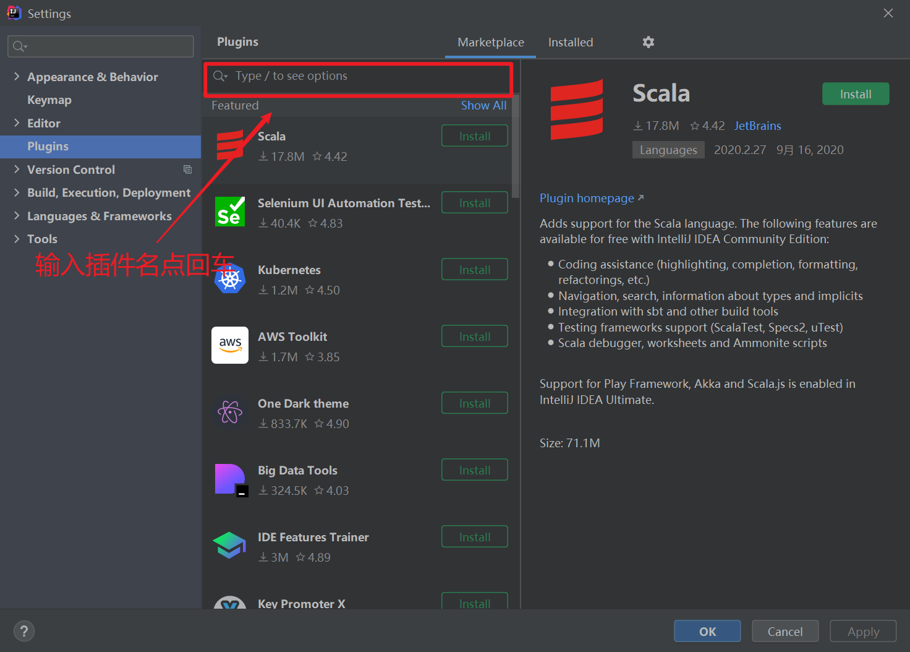

# 开发工具准备

## 视频

乐优商城在线视频链接：[开始学习](https://www.bilibili.com/video/BV1j4411p7UJ	"乐优商城在线观看")

## 概述

常用的一些开发工具，提高开发效率。

+ IDEA
+ Postman
+ SwitchHosts
+ NodeJS
+ VSCode

## IDEA

### 安装插件

1. `File` -> `Settings` -> `Plugins` -> `Marketplace`。（快捷键 `Ctrl + Alt + S`）

   

2. 在市场中搜索需要的插件

### 必备插件

+ **FindBugs：**检查异常
+ **Alibaba Java Coding Guidelines：**阿里巴巴公司试行的开发设计规范
+ **Save Actions：**保存时自动格式化代码
+ **Lombok：** 简化 getter/setter
+ **POJO to JSON：** 一键复制实体类为 Json 格式（对实体类右键 -> MakeJson）
+ **JRebel：** 热部署（收费插件，学习版在群分享的 IDEA 目录下）

